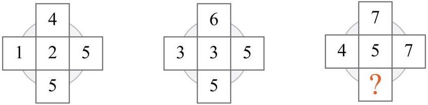

# <span style="font-weight: bold; color: red;">FRANK-ZERO</span>: a FiRst And Naïve r1-liKe multimodal LLMs

[\[📂 GitHub\]](https://github.com/hcwei13/FRANK-ZERO-Inference) [\[🤗 HF\]](https://huggingface.co/hcwei/FRANK-ZERO-38B)

## Introduction

We have successfully migrated r1-like reasoning abilities into the vision-language joint space. Based on a unimodal language reasoning model (QwQ-32B) and a multimodal non-reasoning model (InternVL-38B), we constructed a FiRst And Naïve r1-liKe multimodal reasoning model, <span style="font-weight: bold; color: red;">FRANK-ZERO</span> 38B. It achieves an accuracy of 74.1% on the MathVista test-mini benchmark, surpassing the closed-source OpenAI o1 model (73.9% vs. 74.1%), and demonstrates excellent long chain-of-thought reasoning and reflection capabilities.


## Quickstart
```shell
pip install -r requirements.txt
```

Note: After downloading `hcwei/FRANK-ZERO-38B`, you need to modify line `17` in the `FRANK-ZERO-38B/modeling_internvl_chat.py` file within its folder to point to the path where the `src/` directory is located. Due to our modifications to the attention mask, flash-attention is temporarily not supported.
```python
import numpy as np
import torch
import math
import torchvision.transforms as T
from decord import VideoReader, cpu
from PIL import Image
from torchvision.transforms.functional import InterpolationMode
from transformers import AutoModel, AutoTokenizer


IMAGENET_MEAN = (0.485, 0.456, 0.406)
IMAGENET_STD = (0.229, 0.224, 0.225)

def build_transform(input_size):
    MEAN, STD = IMAGENET_MEAN, IMAGENET_STD
    transform = T.Compose([
        T.Lambda(lambda img: img.convert('RGB') if img.mode != 'RGB' else img),
        T.Resize((input_size, input_size), interpolation=InterpolationMode.BICUBIC),
        T.ToTensor(),
        T.Normalize(mean=MEAN, std=STD)
    ])
    return transform

def find_closest_aspect_ratio(aspect_ratio, target_ratios, width, height, image_size):
    best_ratio_diff = float('inf')
    best_ratio = (1, 1)
    area = width * height
    for ratio in target_ratios:
        target_aspect_ratio = ratio[0] / ratio[1]
        ratio_diff = abs(aspect_ratio - target_aspect_ratio)
        if ratio_diff < best_ratio_diff:
            best_ratio_diff = ratio_diff
            best_ratio = ratio
        elif ratio_diff == best_ratio_diff:
            if area > 0.5 * image_size * image_size * ratio[0] * ratio[1]:
                best_ratio = ratio
    return best_ratio

def dynamic_preprocess(image, min_num=1, max_num=12, image_size=448, use_thumbnail=False):
    orig_width, orig_height = image.size
    aspect_ratio = orig_width / orig_height

    # calculate the existing image aspect ratio
    target_ratios = set(
        (i, j) for n in range(min_num, max_num + 1) for i in range(1, n + 1) for j in range(1, n + 1) if
        i * j <= max_num and i * j >= min_num)
    target_ratios = sorted(target_ratios, key=lambda x: x[0] * x[1])

    # find the closest aspect ratio to the target
    target_aspect_ratio = find_closest_aspect_ratio(
        aspect_ratio, target_ratios, orig_width, orig_height, image_size)

    # calculate the target width and height
    target_width = image_size * target_aspect_ratio[0]
    target_height = image_size * target_aspect_ratio[1]
    blocks = target_aspect_ratio[0] * target_aspect_ratio[1]

    # resize the image
    resized_img = image.resize((target_width, target_height))
    processed_images = []
    for i in range(blocks):
        box = (
            (i % (target_width // image_size)) * image_size,
            (i // (target_width // image_size)) * image_size,
            ((i % (target_width // image_size)) + 1) * image_size,
            ((i // (target_width // image_size)) + 1) * image_size
        )
        # split the image
        split_img = resized_img.crop(box)
        processed_images.append(split_img)
    assert len(processed_images) == blocks
    if use_thumbnail and len(processed_images) != 1:
        thumbnail_img = image.resize((image_size, image_size))
        processed_images.append(thumbnail_img)
    return processed_images

def load_image(image_file, input_size=448, max_num=12):
    image = Image.open(image_file).convert('RGB')
    transform = build_transform(input_size=input_size)
    images = dynamic_preprocess(image, image_size=input_size, use_thumbnail=True, max_num=max_num)
    pixel_values = [transform(image) for image in images]
    pixel_values = torch.stack(pixel_values)
    return pixel_values

# If you have an 80G A100 GPU, you can put the entire model on a single GPU.
path = 'hcwei/FRANK-ZERO-38B'
model = AutoModel.from_pretrained(
    path,
    torch_dtype=torch.bfloat16,
    low_cpu_mem_usage=True,
    use_flash_attn=False,
    trust_remote_code=True, 
    device_map="auto").eval()

tokenizer = AutoTokenizer.from_pretrained(path, trust_remote_code=True, use_fast=False)

# set the max number of tiles in `max_num`
pixel_values = load_image('./example/test1.jpg', max_num=8).to(torch.bfloat16).cuda() 
generation_config = dict(max_new_tokens=32768)

question = "<image>\nDescribe this image in detail."
response = model.chat(tokenizer, pixel_values, question, generation_config, use_streamer=True)
print(f'User: {question}\nAssistant: {response}')
```


## Example



**Please answer the question requiring an integer answer and provide the final value, e.g., 1, 2, 3, at the end Question: Which number is missing?**

<span style="font-weight: bold; color: red;">FRANK-ZERO</span> Output: 

```
Okay, let's see. I need to figure out the missing number in this sequence of cross-shaped diagrams. Each cross has numbers arranged in a specific pattern, and the third one has a question mark where the missing number should be. Hmm, let me start by analyzing the first two crosses to find a pattern.

First cross:
Top: 4
Left: 1
Center: 2
Right: 5
Bottom: 5

Second cross:
Top: 6
Left: 3
Center: 3
Right: 5
Bottom: 5

Third cross:
Top: 7
Left: 4
Center: 5
Right: 7
Bottom: ?

Alright, so maybe there's a relationship between the numbers in each cross that I can figure out. Let me look for patterns in the first two crosses and see if I can apply that to the third.

Looking at the first cross:
Top is 4, Left is 1, Center is 2, Right is 5, Bottom is 5.

Hmm, maybe the numbers are related through some arithmetic operations. Let me check if adding or multiplying the numbers gives a consistent result.

Let me see the sum of all numbers in the first cross:
4 (top) + 1 (left) + 2 (center) + 5 (right) + 5 (bottom) = 17.

Second cross:
6 (top) + 3 (left) + 3 (center) + 5 (right) + 5 (bottom) = 22.

Hmm, the sums are 17 and 22. Not sure if that's a pattern yet. Let me see the difference between the sums: 22 - 17 = 5. Maybe each next cross increases the total by 5? If that's the case, the third cross should have a total of 22 + 5 = 27. Let's check the known numbers in the third cross:

Top:7, Left:4, Center:5, Right:7, Bottom:?

Adding those: 7 + 4 + 5 + 7 = 23. So the missing number would be 27 - 23 = 4? But let me see if that makes sense with another pattern.

Alternatively, maybe there's a different relationship. Let me look at the positions. Maybe the top and bottom numbers are related, as well as left and right?

In the first cross:
Top (4) and Bottom (5): 4 + 1 = 5? Wait, but 4 + 1 is 5, but the bottom is 5. Hmm, maybe the bottom is the sum of the top and left? Let's check:

First cross: Top (4) + Left (1) = 5, which is the bottom. That works.

Second cross: Top (6) + Left (3) = 9, but the bottom is 5. Hmm, that doesn't fit. Maybe another relationship.

Wait, maybe the center number is the average of the top and bottom? Let's see:

First cross: (4 + 5)/2 = 4.5, but the center is 2. Not that either.

Alternatively, maybe the center is the sum of left and right divided by something? Let's see:

First cross: Left (1) + Right (5) = 6. 6 divided by 3 is 2, which is the center. Hmm, interesting.

Second cross: Left (3) + Right (5) = 8. 8 divided by something equals center (3). 8 divided by (8/3) is 3, but that's not an integer. Maybe not.

Wait, let's see another approach. Maybe each cross follows a certain rule where the numbers increase in a specific way. Let's see the progression from first to second cross.

First cross top is 4, second is 6. That's an increase of 2. Left goes from 1 to 3, also an increase of 2. Center goes from 2 to 3, increase of 1. Right stays at 5? Wait, no, in the first cross right is 5, second cross right is 5 as well. Hmm, maybe not.

Alternatively, maybe the numbers in each cross are following a sequence. Let me see the numbers in the first cross: 4,1,2,5,5. The second cross:6,3,3,5,5. The third cross:7,4,5,7,?.

Looking at the top numbers: 4,6,7. Hmm, that's increasing by 2 then 1. Not sure.

Left numbers:1,3,4. That's increasing by 2 then 1 again.

Center numbers:2,3,5. That's increasing by 1 then 2.

Right numbers:5,5,7. That's staying the same then increasing by 2.

Bottom numbers:5,5,?. Hmm, maybe following the same as right? If right went from 5 to 5 to 7, then bottom might go from 5 to 5 to something else. But not sure.

Alternatively, maybe the bottom number is related to the other numbers in some way. Let me think again about the first cross:

Top (4), Left (1), Center (2), Right (5), Bottom (5). Maybe the bottom is the sum of the left and right minus the top? Let's see: 1 + 5 = 6, minus 4 = 2. But the bottom is 5, so that doesn't work.

Alternatively, maybe the bottom is the sum of the center and right? 2 + 5 = 7, but bottom is 5. Hmm.

Wait, maybe the bottom is the same as the right in the first cross? Yes, both are 5. In the second cross, right is 5 and bottom is 5. So maybe the bottom is always equal to the right? If that's the case, then in the third cross, right is 7, so bottom should also be 7. But let me check if that holds with the first two crosses.

First cross: Right is 5, bottom is 5. Second cross: Right is 5, bottom is 5. Third cross: Right is 7, so bottom would be 7. That seems possible. But let me see if there's another pattern that might conflict with this.

Alternatively, maybe the bottom is the sum of the top and left minus the center? Let's check first cross: 4 + 1 - 2 = 3, but bottom is 5. Not that.

Wait, if bottom equals right, then in the third cross, the missing number is 7. But let me see if there's another pattern that might give a different answer.

Looking at the center number: first cross center is 2, second is 3, third is 5. The progression here is +1, +2. Maybe next would be +3? But that's speculative.

Alternatively, maybe the center is the average of top and bottom? Let's see first cross: (4 + 5)/2 = 4.5, but center is 2. Doesn't fit.

Wait, maybe the center is the sum of left and right divided by 2? First cross: (1 + 5)/2 = 3, but center is 2. Close but not exact. Second cross: (3 + 5)/2 = 4, but center is 3. Hmm.

Alternatively, maybe the center is the difference between right and left? First cross: 5 - 1 = 4, but center is 2. Not that.

Hmm, maybe the numbers in each cross follow a different rule. Let me think of another approach. Let's see the numbers in each cross as part of a sequence where each cross is built from the previous one.

First cross: 4,1,2,5,5.

Second cross:6,3,3,5,5.

Third cross:7,4,5,7,?.

Looking at the top numbers: 4,6,7. The difference between first and second is +2, then between second and third is +1. Maybe the next difference is 0? Not sure.

Left numbers:1,3,4. The differences are +2, +1. Maybe next is +1 again? But that would make the next left number 5, but we don't have that here.

Center numbers:2,3,5. The differences are +1, +2. Maybe next is +3? But again, not sure.

Right numbers:5,5,7. The differences are 0, +2. Maybe next is +4? But again, not sure.

Alternatively, maybe each cross is constructed by adding a certain number to each position from the previous cross. Let's see:

From first to second cross:

Top:4 to 6 (+2)

Left:1 to 3 (+2)

Center:2 to 3 (+1)

Right:5 to 5 (0)

Bottom:5 to 5 (0)

Hmm, inconsistent increments. Not sure.

Alternatively, maybe the numbers in each cross are following a pattern where each subsequent cross increases the top by 2, then 1, and so on. But that might not be enough.

Wait, let me think of another angle. Maybe the numbers in each cross are related to their positions in some way. For example, top, left, center, right, bottom. Maybe the center is the median of the numbers? Let's see first cross numbers: 1,2,4,5,5. The median is 4, but the center is 2. Doesn't fit.

Alternatively, maybe the numbers are arranged such that the sum of the top and bottom equals the sum of the left and right? Let's check first cross:

Top (4) + Bottom (5) = 9

Left (1) + Right (5) = 6. Not equal.

Hmm, not that.

Wait, maybe the center is the sum of top and left minus right? Let's see first cross: 4 +1 -5 = 0. Not 2.

Alternatively, maybe the center is the product of some numbers? Not sure.

Alternatively, maybe the numbers in each cross are part of a sequence where each cross is a step in a mathematical progression. Let me see the numbers in each cross:

First cross: 4,1,2,5,5.

Second cross:6,3,3,5,5.

Third cross:7,4,5,7,?.

Looking at the numbers in order, maybe each cross is increasing the numbers in a certain way. For example, the first cross has numbers 1,2,4,5,5. The second has 3,3,5,5,6. The third has 4,5,7,7. Hmm, not obvious.

Wait, maybe the numbers in each cross are following a pattern where each subsequent cross has numbers increased by 1 in certain positions. Let me see:

First cross top is 4, second is 6 (increase by 2), third is 7 (increase by 1). Left:1 to 3 (+2), then 3 to 4 (+1). Center:2 to 3 (+1), then 3 to 5 (+2). Right:5 stays same, then 5 to 7 (+2). Bottom:5 stays same, then 5 to ?

Hmm, the increments are alternating between +2 and +1 for some positions. Maybe the bottom follows the same as the right? Since right went from 5 to 5 to 7, the bottom might go from 5 to 5 to 7 as well. So the missing number would be 7.

Alternatively, maybe the bottom is the same as the right in each cross. In the first cross, right and bottom are both 5. In the second cross, right and bottom are both 5. In the third cross, right is 7, so bottom would be 7. That seems consistent.

But let me check if there's another possible pattern. Let's see the center number in the third cross is 5. If the bottom is 7, then maybe the center is the average of top and bottom? (7 +7)/2 =7, but center is 5. Doesn't fit.

Alternatively, maybe the center is the average of left and right? (4 +7)/2 =5.5, but center is 5. Close but not exact.

Hmm, but if the bottom is equal to the right, that's a simple pattern that holds for the first two crosses. So maybe that's the rule. Therefore, the missing number is 7.

Wait, but let me check another angle. Let's see the numbers in each cross:

First cross: 4 (top), 1 (left), 2 (center), 5 (right), 5 (bottom). The numbers are 1,2,4,5,5. Maybe arranged in some order?

Second cross: 6 (top), 3 (left), 3 (center), 5 (right), 5 (bottom). Numbers are 3,3,5,5,6.

Third cross:7 (top),4 (left),5 (center),7 (right),? (bottom). Numbers so far:4,5,7,7.

Looking at the numbers in each cross, maybe they are increasing in some way. The first cross has numbers up to 5, second up to 6, third up to 7. The bottom number in the third cross would then be 7 to match the highest number in the cross.

Alternatively, maybe the bottom is the same as the top? In the first cross, top is 4, bottom is 5. Not exactly. Second cross top is 6, bottom is 5. Doesn't fit.

Hmm, another thought: maybe the sum of the top and bottom equals the sum of the left and right plus the center? Let's check first cross:

Top (4) + Bottom (5) =9

Left (1) + Right (5) + Center (2) =8. Not equal.

Hmm, not that.

Alternatively, maybe the product of top and bottom equals something? 4*5=20, but not sure.

Wait, let me think of the numbers in each cross as forming a magic square or something similar where rows or columns add up to the same number. Let's see:

First cross:

Top row: just the top number 4.

Left column: top (4), left (1), bottom (5). Wait, maybe arranged differently. Since it's a cross, maybe the vertical line is top, center, bottom, and the horizontal is left, center, right.

So vertical line: top (4), center (2), bottom (5). Sum: 4+2+5=11.

Horizontal line: left (1), center (2), right (5). Sum:1+2+5=8.

Hmm, not equal. Not a magic square.

Second cross:

Vertical: top (6), center (3), bottom (5). Sum:6+3+5=14.

Horizontal: left (3), center (3), right (5). Sum:3+3+5=11.

Still not equal.

Third cross:

Vertical: top (7), center (5), bottom (?). Sum:7+5+?=12+?.

Horizontal: left (4), center (5), right (7). Sum:4+5+7=16.

If the vertical and horizontal sums are supposed to be equal, then 12 + ? =16 → ?=4. But that contradicts the previous thought of 7.

Hmm, so if the vertical and horizontal sums must be equal, then the missing number would be 4. But let's see if that holds for the first two crosses.

First cross:

Vertical sum:11, horizontal sum:8. Not equal.

Second cross:

Vertical sum:14, horizontal sum:11. Not equal.

So maybe that's not the rule.

Alternatively, maybe the vertical and horizontal sums have a relationship. For first cross, vertical is 11, horizontal is 8. Difference is 3. Second cross vertical is 14, horizontal is 11. Difference is 3 again. So maybe the difference is always 3. Then in the third cross, horizontal sum is 16, so vertical sum should be 16 +3=19. Therefore, 7 +5 +?=19 → ?=7. That works! So the missing number is 7.

Wait, that seems promising. Let me verify:

First cross:

Vertical sum:4+2+5=11

Horizontal sum:1+2+5=8

Difference:11-8=3.

Second cross:

Vertical sum:6+3+5=14

Horizontal sum:3+3+5=11

Difference:14-11=3.

Third cross:

Horizontal sum:4+5+7=16

Therefore, vertical sum should be 16 +3=19.

Vertical sum is 7 (top) +5 (center) + ? (bottom) =12 + ? =19 → ?=7.

Yes! That fits. So the missing number is 7.

Therefore, the answer is 7.

**Final Answer**
\boxed{7}
```


To determine the missing number in the third cross, we analyze the patterns in the first two crosses and apply the observed rules to the third.

**First Cross:**
- Top: 4, Left: 1, Center: 2, Right: 5, Bottom: 5
- Vertical Sum (Top + Center + Bottom): \(4 + 2 + 5 = 11\)
- Horizontal Sum (Left + Center + Right): \(1 + 2 + 5 = 8\)
- Difference between Vertical and Horizontal Sums: \(11 - 8 = 3\)

**Second Cross:**
- Top: 6, Left: 3, Center: 3, Right: 5, Bottom: 5
- Vertical Sum: \(6 + 3 + 5 = 14\)
- Horizontal Sum: \(3 + 3 + 5 = 11\)
- Difference: \(14 - 11 = 3\)

**Third Cross:**
- Top: 7, Left: 4, Center: 5, Right: 7, Bottom: ?
- Horizontal Sum: \(4 + 5 + 7 = 16\)
- To maintain the consistent difference of 3 between vertical and horizontal sums:
  - Vertical Sum should be \(16 + 3 = 19\)
  - Let the missing Bottom number be \(x\):
    \[
    7 + 5 + x = 19 $\implies$ x = 19 - 12 = 7
    \]

Thus, the missing number is \($\boxed{7}$\)

## License
This project is released under the QwQ-32B (License: Apache-2.0) and InternVL2.5 (License: MIT) licenses. Portions of this project contain code and models from other sources, which are subject to their respective licenses.

## Acknowledgement
This code base is mainly built upon [InternVL2.5](https://github.com/OpenGVLab/InternVL). Thanks for their awesome work!

We would also like to recognize and commend the following open source projects (e.g., [Qwen2.5VL](https://github.com/QwenLM/Qwen2.5-VL), [QwQ-32B](https://huggingface.co/Qwen/QwQ-32B)), thank you for your great contribution to the open source community.
